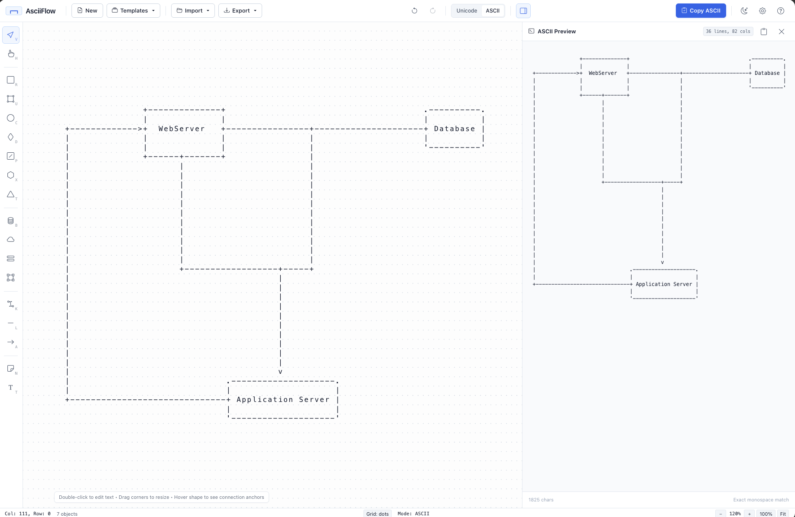

# AsciiFlow

**AsciiFlow** is a modern, elegant ASCII diagram and flowchart editor inspired by visual diagramming tools such as Microsoft Visio, diagrams.net, and Monodraw. It combines the visual fluidity of a vector diagram editor with the timeless portability of plain-text monospace ASCII and Unicode art.

Diagrams can be designed visually with drag-and-drop shapes, orthogonal connectors, and inline text editing, and then exported or copied to the clipboard with one click to paste directly into GitHub markdown, terminal environments, code comments, Slack, Discord, Jira, or technical documentation — remaining visually intact and aligned.

**🔗 [Try it live](https://jozeta.github.io/AsciiFlow/)**



---

## Key Features

- **Bidirectional Text & Code Import**:
  - **ASCII Reverse Engineering**: Paste raw ASCII / Unicode text diagrams. AsciiFlow extracts bounding boxes, text labels, borders, and connectors back into editable vector shapes!
  - **Mermaid Flowchart Import**: Paste Mermaid `graph TD` or `graph LR` syntax. Nodes, shapes, edge types, and labels are automatically parsed and arranged hierarchically with auto-layout!
  - **Shareable URL Hash**: Generate instant shareable links with diagram data compressed into `#diagram=...` for frictionless collaboration without a backend database.
- **Smart Alignment & Auto-Layout**:
  - **Align Tools**: One-click alignment across multi-selections (Align Left, Center, Right, Top, Middle, Bottom).
  - **Distribute Tools**: Distribute 3+ shapes evenly across horizontal or vertical space.
  - **Magnetic Alignment Guides**: Snaps shapes to adjacent centers, borders, and midpoints as you drag, displaying cyan guide lines.
  - **Hierarchical Auto-Layout**: Automatic DAG / topological ranking layout that arranges complex flowcharts cleanly in either Top-to-Bottom or Left-to-Right hierarchies.
- **Extended Architecture & Cloud Shapes**:
  - **Database Cylinder**: Top elliptical cap, mid-cylinder rim, and centered body text.
  - **Cloud VPC / Network**: Scalloped arches and rounded lobes.
  - **Message Queue**: Horizontal FIFO buffer slots with vertical dividers.
  - **Subsystem Container / Boundary**: Dashed boundary box with embedded top title that preserves nested child shapes.
  - **Shape Grouping**: Group (`Ctrl+G`) and ungroup (`Ctrl+Shift+G`) multiple shapes to move and manipulate them as a cohesive unit.
- **Dual-End Customizable Arrowheads & Line Styles**:
  - Dual terminals: Customize **Start Arrowhead** and **End Arrowhead** independently.
  - Arrowhead shapes: Solid Triangle (`►`), Open Chevron (`▷`), Dot (`●`), Diamond (`◆`), and Bar/Tee (`│`).
  - Line Styles: Solid (`─`), Dashed (`╌`), Dotted (`┈`), and Double Border (`═`).
  - Routing Modes: Smart Manhattan **Orthogonal** routing or Direct **Straight** line routing.
- **Multi-Format Export Options**:
  - **Export as SVG**: Vector graphics with monospace font stacks and clean background containers.
  - **Export as PNG**: High-DPI rasterized PNG image download.
  - **Copy as Markdown**: Instant clipboard copy formatted as ```` ```text ... ``` ```` for documentation and PR descriptions.
  - **Save as JSON**: Full diagram model persistence.
  - **Download ASCII (.txt)**: Plain text ASCII art file.

```
/
├── index.html          # Application shell, layout, modals, and toolbars
├── LICENSE             # MIT License
├── .gitignore          # Git ignore specifications
├── css/
│   └── app.css         # Nordic design system, light/dark themes, monospace styles
├── js/
│   ├── parser.js       # ASCII reverse-parser and Mermaid flowchart syntax converter
│   ├── renderer.js     # 2D character matrix engine, line styles, arrowheads, and SVG rasterizer
│   ├── shapes.js       # Shape definitions, geometry math, anchors, auto-fit, and grouping
│   ├── connectors.js   # Connector models, segment hit-testing, styles, and terminal definitions
│   ├── history.js      # Undo/Redo stack manager with snapshot cloning
│   ├── storage.js      # Persistence, multi-format export (SVG, PNG, MD), and URL hash sharing
│   ├── theme.js        # Light/Dark theme manager and reactive canvas updates
│   ├── canvas.js       # Interactive canvas controller, magnetic snap, alignment, auto-layout
│   └── app.js          # Main application orchestrator and event wiring
└── README.md
```

### 1. Internal Diagram Representation

Diagrams are stored as clean JSON data structures that describe objects semantically rather than as pre-baked text strings:

```json
{
  "version": 1,
  "name": "Authentication Flow",
  "mode": "unicode",
  "shapes": [
    {
      "id": "shape_1",
      "type": "rounded-rectangle",
      "x": 4,
      "y": 3,
      "w": 16,
      "h": 5,
      "text": "Start\nLogin Request",
      "textAlign": "center"
    }
  ],
  "connectors": [
    {
      "id": "conn_1",
      "type": "connector",
      "fromShapeId": "shape_1",
      "fromAnchor": "right",
      "toShapeId": "shape_2",
      "toAnchor": "left",
      "arrowEnd": "end",
      "label": "HTTPS"
    }
  ],
  "texts": [],
  "notes": []
}
```

### 2. The ASCII Rendering Algorithm (`renderer.js`)

The rendering engine operates on a 2D discrete character grid:

1. **Bounding Box Calculation**:
   Calculates the minimum and maximum column and row bounds across all shapes, notes, connectors, and labels, adding configurable margins.
2. **Matrix Allocation**:
   Creates an `AsciiGrid` instance with dimensions `[height][width]`. Each cell contains a character (`char`), a collision type (`'space'`, `'border'`, `'line'`, `'junction'`, `'arrow'`, `'text'`), and an `ownerId`.
3. **Pass 1 — Shape Interior & Borders**:
   - Shapes clear their interior bounding boxes with spaces to prevent background bleed.
   - Borders are rasterized using coordinate math for rectangles, single-step diagonal calculations for diamonds and hexagons, and rounded corners for circles and rounded boxes.
4. **Pass 2 — Orthogonal Connector Routing**:
   - Computes Manhattan waypoints `[p0, p1, ..., pn]` between source and target anchors.
   - Draws horizontal segments (`─` or `-`) and vertical segments (`│` or `|`).
   - Places corner turns (`┌`, `┐`, `└`, `┘` or `+`).
   - Resolves intersections: when a horizontal connector crosses a vertical connector, it creates a junction (`┼` or `+`).
   - Resolves border junctions: when a connector leaves a rectangle border, it renders appropriate T-junctions (`├`, `┴`, `┤`, `┬`).
   - Places directional arrowheads (`►`, `◄`, `▼`, `▲` or `>`, `<`, `v`, `^`) pointing cleanly at the target border.
5. **Pass 3 — Text Placement**:
   - Centers or aligns multiline text strings within shapes.
   - Text cells have priority: connectors and lines will never overwrite text characters.
6. **String Export & Trimming**:
   - Rows are mapped to strings.
   - Trailing whitespace is stripped from each line so clipboard payloads remain minimal.

### 3. Visual Canvas & Monospace Geometry (`canvas.js`)

- Operates on a monospace character cell coordinate system (`cellWidth: 10px`, `cellHeight: 18px`).
- Mouse screen coordinates are mapped to grid cells via:
  ```javascript
  col = Math.floor((screenX - panX) / (cellWidth * zoom));
  row = Math.floor((screenY - panY) / (cellHeight * zoom));
  ```
- HiDPI (Retina) canvas scaling with smooth hardware-accelerated drawing.
- 8-point interactive resize handles (NW, N, NE, E, SE, S, SW, W).
- Glowing anchor points on shape borders for visual connector creation.
- Floating in-place `<textarea>` overlay on double-click with identical monospace font and line-height.

---

## Keyboard Shortcuts

| Shortcut | Action |
| :--- | :--- |
| `Ctrl / Cmd + Z` | Undo |
| `Ctrl / Cmd + Shift + Z` (or `Ctrl + Y`) | Redo |
| `Ctrl / Cmd + C` | Copy ASCII diagram / selected object |
| `Ctrl / Cmd + D` | Duplicate selected shapes |
| `Ctrl / Cmd + A` | Select all shapes and connectors |
| `Delete` / `Backspace` | Delete selected shapes and connectors |
| `Arrow Keys` | Nudge selected shape(s) by 1 character cell |
| `Shift + Arrow Keys` | Nudge selected shape(s) by 5 character cells |
| `Space + Drag` (or Middle Click) | Pan canvas |
| `Ctrl / Cmd + Mouse Wheel` | Zoom in / out relative to cursor |
| `Double Click` | Edit shape text in-place |
| `Escape` | Cancel current tool / Deselect |
| `V` | Select tool |
| `H` | Hand / Pan tool |
| `R` | Rectangle tool |
| `U` | Rounded Rectangle tool |
| `D` | Diamond (Decision) tool |
| `P` | Parallelogram (I/O) tool |
| `X` | Hexagon (Preparation) tool |
| `C` | Circle / Ellipse tool |
| `K` / `W` | Connector tool |
| `L` | Line tool |
| `A` | Arrow tool |
| `T` | Text Label tool |
| `N` | Note Box tool |

---

## Example Diagrams

AsciiFlow includes three built-in templates accessible directly from the **Templates** header dropdown:

1. **Authentication Flow**:
   User login request $\rightarrow$ input credentials $\rightarrow$ decision diamond $\rightarrow$ success token / failure retry.
2. **System Architecture**:
   Web/mobile client $\rightarrow$ API gateway $\rightarrow$ microservices (Auth, Orders) $\rightarrow$ PostgreSQL/Redis cluster with security notes.
3. **Decision Tree**:
   Urgency vs importance matrix with actionable routing.

---

## License

MIT License. Free to use for personal and commercial documentation, projects, and diagrams.
